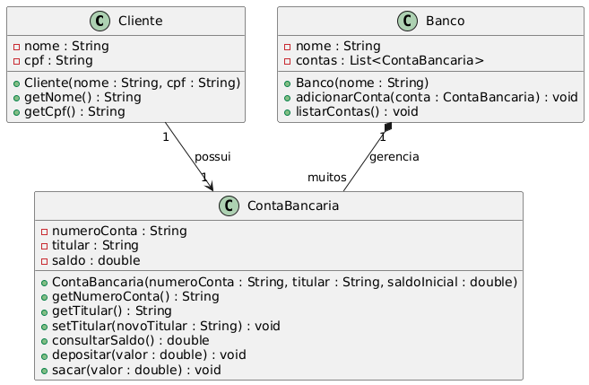

# ✅ Resolução do Exercício 2 — Modelagem da Classe ContaBancaria

⸻

## 🔹 1. Atributos Privados da Classe

Os atributos devem ser declarados como private para garantir que somente a própria classe possa acessá-los diretamente. Isso protege o estado interno do objeto contra alterações indevidas e mantém a integridade dos dados.

Atributos sugeridos:
	•	numeroConta (String ou int): número identificador da conta.
	•	titular (String): nome do titular da conta.
	•	saldo (double): valor monetário disponível na conta.

🔒 Encapsulamento: Ao manter os atributos como privados, evitamos que código externo modifique o saldo diretamente, por exemplo, inserindo um valor negativo ou corrompendo o número da conta.

## 🔹 2. Métodos Públicos: Getters e Setters (de forma seletiva)
	•	Getter para numeroConta e titular: Permitido, pois são informações de identificação (somente leitura).
	•	Setter para titular (opcional): Pode ser oferecido se o nome do titular puder ser atualizado.
	•	Getter para saldo: Deve ser controlado (por exemplo, apenas leitura com consultarSaldo()), sem setter direto.

⚠️ Evita-se um setter para saldo, pois o valor do saldo só deve ser alterado por meio dos métodos depositar() e sacar(), os quais impõem regras e validações (por exemplo, evitar saldo negativo).

## 🔹 3. Métodos Públicos: Ações da Conta
	•	depositar(double valor): adiciona um valor positivo ao saldo. Deve rejeitar depósitos negativos.
	•	sacar(double valor): retira um valor do saldo, apenas se houver saldo suficiente.
	•	consultarSaldo(): retorna o saldo atual, sem permitir modificação.

## Justificativa para o Uso de Atributos Privados

Manter os atributos como privados é fundamental para aplicar o princípio de encapsulamento, que visa proteger o estado interno do objeto e garantir que ele só seja alterado de maneira válida.

Expor diretamente o atributo saldo permitiria, por exemplo:
	•	Saldo ser ajustado para valores negativos arbitrariamente.
	•	Inconsistência em registros financeiros (sem controle de fluxo).
	•	Quebras de lógica da aplicação, como saques sem validação.

## Síntese Final (Objetivos Didáticos Alcançados)
	•	Aplicação dos modificadores de acesso private e public de forma apropriada.
	•	Entendimento do encapsulamento como prática para garantir segurança e integridade de dados sensíveis.
	•	Uso seletivo de getters e setters, priorizando o controle interno do estado.
	•	Modelagem alinhada a boas práticas de POO, evitando exposição desnecessária e mantendo a responsabilidade concentrada na própria classe.

## Solução em UML
