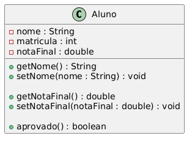

# ✅ Exercício 4 — Controle de Acesso e Encapsulamento

## 🧾 Tema: Visibilidade e Modificadores de Acesso

---

## 🔹 Descrição

Implemente a classe `Aluno` com os seguintes requisitos:

- **Atributos privados**:
  - `nome : String`
  - `matricula : int`
  - `notaFinal : double`

- **Métodos públicos**:
  - Getters e setters apenas para `nome` e `notaFinal`
  - Um método `aprovado()` que retorna `true` se `notaFinal >= 6.0`

---

## 🎯 Objetivo Didático

Aplicar o uso correto dos **modificadores de acesso** (`private`, `public`) para reforçar o **princípio de encapsulamento**, evitando a exposição desnecessária do estado interno da classe.

---

## 💡 Explicação da Solução

A seguir, a estrutura da classe `Aluno`, destacando os pontos principais da modelagem:

### 🔒 Atributos Privados

```java
private String nome;
private int matricula;
private double notaFinal;

## UML
