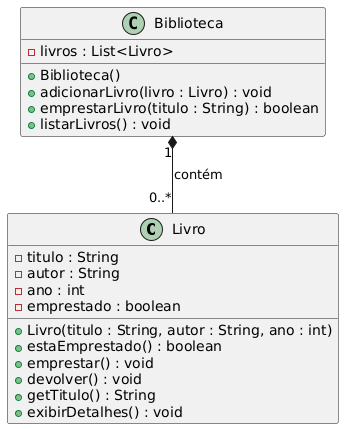

# ✅ Exercício 7 — Projeto Modular com Encapsulamento

---

## 🧾 Tema: Modularidade e Organização de Classes

---

## 🔹 Descrição

Desenvolva um pequeno sistema para controle de uma biblioteca, composto por duas classes principais:

- **Livro**: representa um livro com os seguintes atributos privados:
  - `título` (String)
  - `autor` (String)
  - `ano` (int)
  - `statusEmprestimo` (boolean) — indica se o livro está emprestado ou disponível

- **Biblioteca**: gerencia uma coleção de livros e oferece métodos para:
  - Adicionar livros à coleção
  - Emprestar livros (alterando o status do livro)
  - Listar livros, exibindo suas informações e status

---

## 🎯 Objetivo Didático

- Promover a **modularidade**: dividir o sistema em componentes (classes) coesas e independentes.
- Enfatizar o **encapsulamento**: proteger o estado interno de cada objeto, expondo apenas o necessário via métodos públicos.
- Destacar a **separação de responsabilidades**:  
  - A classe `Livro` representa e controla o estado individual de cada livro.  
  - A classe `Biblioteca` é responsável por gerenciar a coleção, coordenando operações sobre os livros.

---

## 💡 Explicação da Solução

### 1. Classe `Livro`

- Atributos **privados** para proteger dados sensíveis e garantir integridade.
- Métodos públicos para consultar e alterar o status de empréstimo (ex: `emprestar()`, `devolver()`, `estaEmprestado()`).
- Método para exibir detalhes do livro, facilitando a listagem pela biblioteca.

### 2. Classe `Biblioteca`

- Mantém uma coleção interna (ex: lista ou array) de objetos `Livro`.
- Método para adicionar livros à coleção, garantindo a modularidade da inserção.
- Método para emprestar livros, buscando o livro pelo título ou outro identificador e alterando seu status, evitando que o estado do livro seja manipulado diretamente fora da classe `Livro`.
- Método para listar livros, iterando sobre a coleção e exibindo informações de cada livro.

---

## UML

